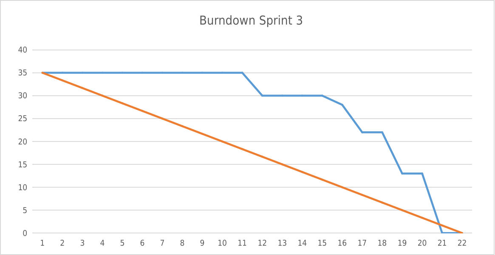

# Artefatos

Repositório onde estão sendo salvos os documentos do time da Bureau referente ao projeto BTAlert.

  

Plataforma de previsibilidade de ocorrências

Desenvolvido pela [BureauTech](https://github.com/BureauTech).

# Sumário

   * [Sobre](#btalertai)
   * [Sumário](#sumário)
   * [Entregas](#entregas)
      * [Burndown](#burndown)
      * [Documentações](#documentações)
   * [Como executar localmente](#como-executar-localmente)
      * [Pré-Requisitos](#pré-requisitos)
      * [Servidor](#servidor)
      * [Cliente](#cliente)
   * [Tecnologias](#tecnologias)
   * [Autores](#autores)

## Aplicação 

Este projeto está dividido, conforme descrição abaixo:

- Aplicação CRUD [Cadastrol - Backend](https://github.com/BureauTech/Cadastrol-Server)
- Aplicação CRUD [Cadastrol - Frontend](https://github.com/BureauTech/Cadastrol-Client)
- Aplicação com Inteligência Artificial [BTAlert](https://github.com/BureauTech/BTAlert-AI)

# Entregas

- *Sprint 1* entrega realizada em 17/04/2022.
- *Sprint 2* entrega realizada em 15/05/2022.
- *Sprint 3* entrega realizada em 05/06/2022.

## Visão geral do projeto

  

  

## Entregas propostas Sprint 3

  

## Burndown

  

  

## Documentações 

- [Product Backlog](docs/Artefatos/Product%20Backlog.pdf)

- [Cronograma](docs/Artefatos/Cronograma.pdf)

- [Escopo do Projeto](docs/Artefatos/Declaracao%20do%20escopo%20do%20Projeto.pdf)

- [Design Thinking](docs/Artefatos/Design%20Thinking.pdf)

- [Documentação CRISP](docs/Artefatos/CRISP.pdf)

- [Termo de Abertura do Projeto](docs/Artefatos/TAP_V0.1.2.pdf)

- [CheckList - Qualidade](docs/Artefatos/CheckList%20-%20Qualidade.pdf)

- [PETI - BSC](docs/Artefatos/PETI%20-%20BSC.pdf)

- [Plano de Custo](docs/Artefatos/Plano%20de%20Custo.pdf)

# Como executar localmente

Para executar a aplicação completa localmente:

### Pré-requisitos:

Para execução da aplicação com inteliência artificial (BTAlert) para realização das predições:

[Clique aqui para acesso ao repositório](https://github.com/BureauTech/BTAlert-AI).

Para execução da aplicação a ser monitorada (Cadastrol), é importante ter ambientado o seu computador conforme documentados em seus repositórios.

[Clique aqui para execução do Backend](https://github.com/BureauTech/Cadastrol-Server)

[Clique aqui para execução do Frontend](https://github.com/BureauTech/Cadastrol-Client)

## Inteligência Artificial

Para execução da ferramenta de inteligência artificial, leia os [procedimentos para execução](https://github.com/BureauTech/BTAlert-AI#locally)

## Servidor

Para execução do lado do servidor (aplicação teste), leia os [procedimentos para execução](https://github.com/BureauTech/Cadastrol-Server#how-to-install). 

## Cliente

Para execução do lado do cliente (aplicação teste), leia os [procedimentos para execução](https://github.com/BureauTech/Cadastrol-Client#how-to-install). 

# Tecnologias

As seguintes ferramentas foram usadas na construção do projeto:

- [NodeJS](https://nodejs.org/)
- [PostgreSQL](https://www.postgresql.org/)
- [VueJS](https://vuejs.org/)
- [Spring Boot](https://spring.io/projects/spring-boot)
- [Docker](https://www.docker.com/)
- [Python](https://www.python.org/)
- [Grafana](https://grafana.com/)
- [Prometheus](https://prometheus.io/)

# Autores

<table align="center">
  <tr>
    <td align="center"><a href="https://github.com/anaclaragraciano"> <b>Ana Clara Dev</b></a> <a href="https://github.com/BureauTech/Artefatos/commits?author=anaclaragraciano" title="PO">:sparkles::iphone::open_book:</a></td>
    <td align="center"><a href="https://github.com/bibiacoutinho"> <b>Beatriz Coutinho Master</b></a> <a href="https://github.com/BureauTech/Artefatos/commits?author=bibiacoutinho" title="Master">:headphones::nail_care::computer_mouse:</a></td>
    <td align="center"><a href="https://github.com/caiquesjc"> <b>Caique Nascimento Dev</b></a> <a href="https://github.com/BureauTech/Artefatos/commits?author=caiquesjc" title="Dev Team">:keyboard::desktop_computer::computer_mouse:</a></td>    
    <td align="center"><a href="https://github.com/charles-ramos"> <b>Charles Ramos PO</b></a> <a href="https://github.com/BureauTech/Artefatos/commits?author=charles-ramos" title="Dev Team">:fist_raised::open_book::hamburger:</a></td> 
</table>
<table align="center">
    <td align="center"><a href="https://github.com/danielsantosoliveira"> <b>Daniel Oliveira Dev</b></a> <a href="https://github.com/BureauTech/Artefatos/commits?author=danielsantosoliveira" title="Dev Team">:computer::guitar::soccer:</a></td>
    <td align="center"><a href="https://github.com/Denis-Lima"> <b>Denis Lima Dev</b></a> <a href="https://github.com/BureauTech/Artefatos/commits?author=Denis-Lima" title="Dev Team">:computer::v::pizza:</a></td>
    <td align="center"><a href="https://github.com/WeDias"> <b>Wesley Dias Dev</b></a> <a href="https://github.com/BureauTech/Artefatos/commits?author=WeDias" title="Dev Team">:rocket::milky_way::new_moon:</a></td>
  </tr>
</table>
